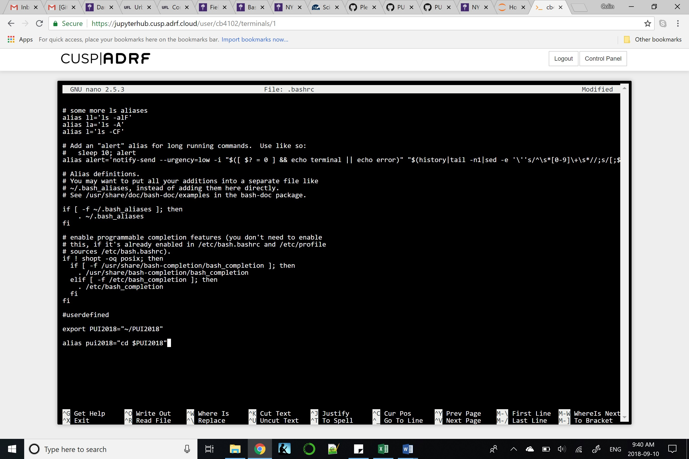
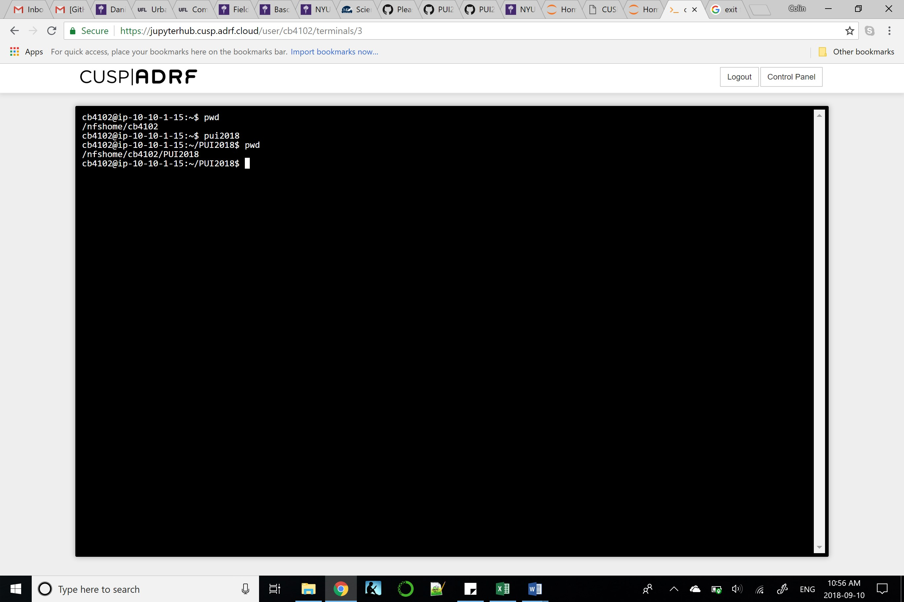

## PUI 2018 Homework 1

This work was conducted independently.

The scope of the homework was to create a virtual environment. First, I created an environmental variable that pointed to the new directory and then created an alias for that environmental variable. In order to make this permanant, I edited the bashrc file.

Here is the screenshot where I adjusted the bash file:

Here is the screenshot where I tested the environmental variable and alias:

