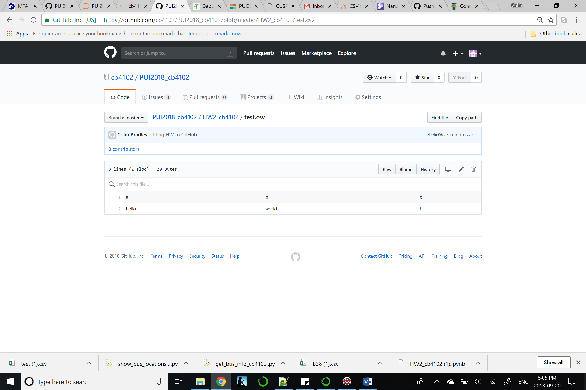

# Homework 2:

This is the homework submission for Week 3 of Principles of Urban Informatics.

## Academic Disclaimer:

For Assignment #1 and Assignment #2 I worked independently.
For Assigment #3 and #4, I worked with Cyrus B. (cb4184) and Sam B. (SHB395). We worked collaboratively on the coding, debugging, and troubleshooting.

# Assignment Explanations:

## Assignment #1

The purpose of assignment 1 was to learn how to delete a file as well as remove it's history from a repository. This is important if sensitive data is accidentally push to a repository and needs to be expunged.

## Assignment #2

The purpose of assignment two was to learn how to read CSV files using Pandas and to perform some basic plotting within Jupyter. In addition, it also introduced us to the NYC Open Data.

## Assignment #3

The purpose of assignemnt three was to learn how to call an API and work with JSON files as well as introduce us to argv, which allows user inputs built into python models. 

## Assignment #4

Assignment #4 builds on assignment #3 but got us to create a CSV based on data being pulled from the JSON file.

# Screenshot for Assignment #1:

