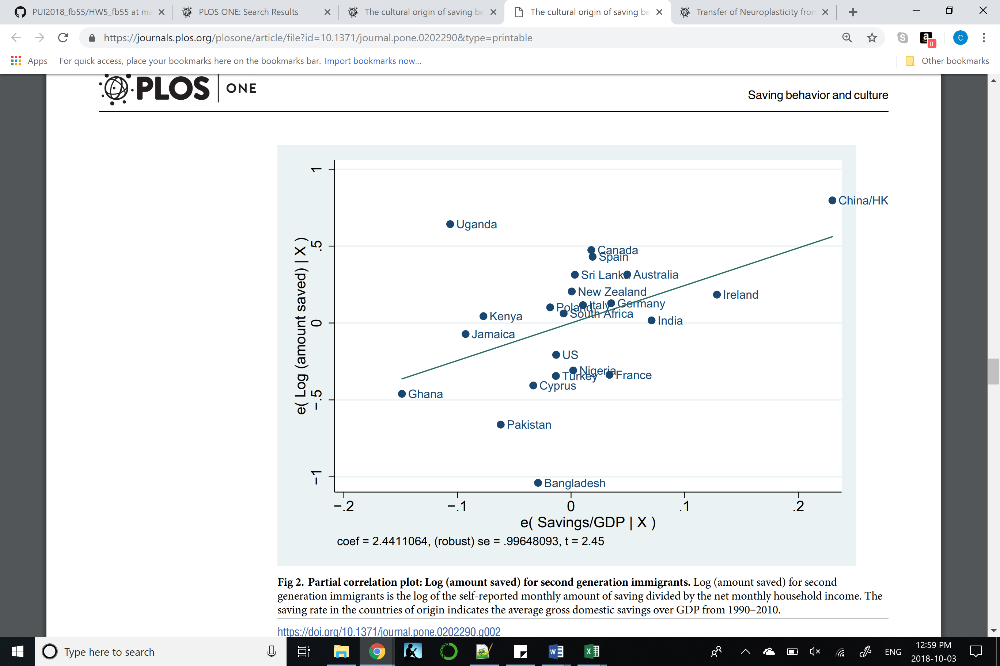
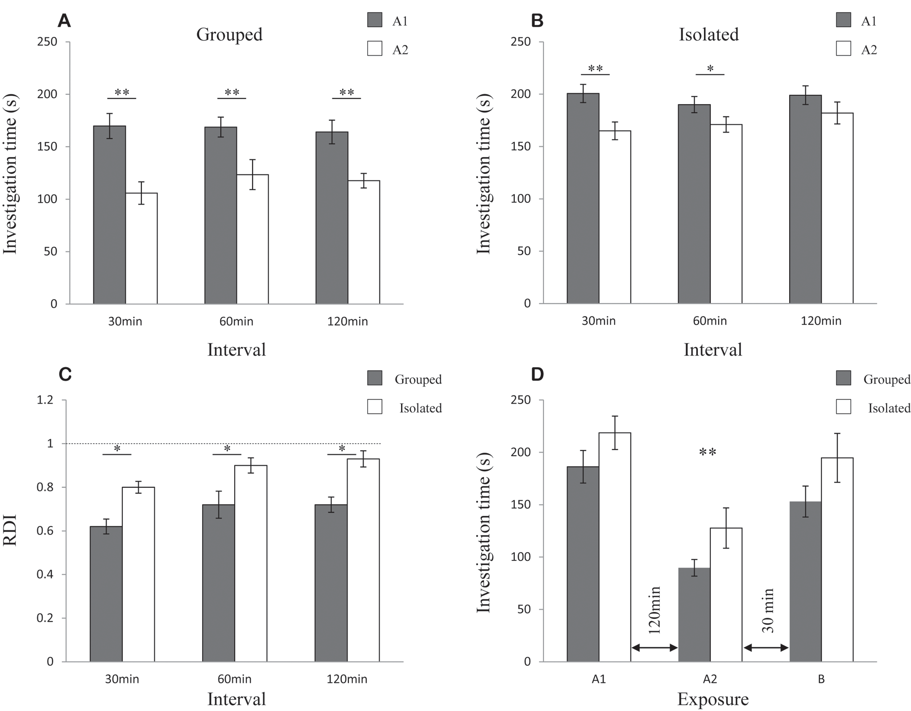
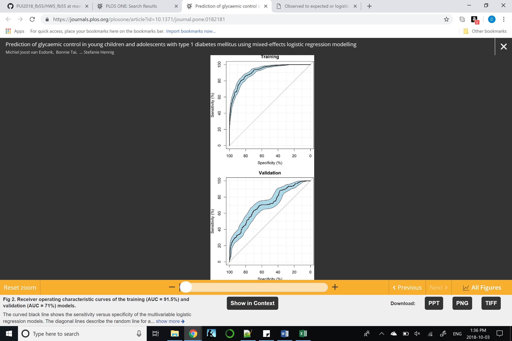

## READ_ME HW5

## Assignment 2: Literature Choices of Statistical Effects

| **Statistical Analyses**	|  **IV(s)**  |  **IV type(s)** |  **DV(s)**  |  **DV type(s)**  |  **Control Var** | **Control Var type**  | **Question to be answered** | **_H0_** | **alpha** | **link to paper**| 
|:----------:|:----------|:------------|:-------------|:-------------|:------------|:------------- |:------------------|:----:|:-------:|:-------|
Multiple Regression	| Savings/GDP of Origin Country | Continuous | Total Amount of Savings; Propensity to Save; Positive Savings| Continuous; Continuous; Continuous | age; gender; married/not married; # of children; log(household net income); employment status| categorical; dicotomous; dicotomous; categorical; continuous; categorical | 	Are savings rates impacted by cultural and social norms? | Impact of cultural factors on savings rate > 0| 0.05 | https://journals.plos.org/plosone/article/file?id=10.1371/journal.pone.0202290&type=printable |

Paired t-test	| 1, Rat held in group environment or rat held in isolation | Dichotomous |1, Long term social recognition memory, as measured by length of time investigating another rat--longer implies lower SRM, shorter implies higher SRM| Continuous | N/A | N/A | 	Do rats' housing conditions impact their social recognition memory? | impact of housing on rat memory = 0 | 0.05 | https://journals.plos.org/plosone/article?id=10.1371/journal.pone.0065085#pone-0065085-g002 |

Logistic regression	| 10 ,Gender, Age, Age at diagnosis, Disease duration, Fractional disease duration, Weight, Height, BMI, HbA1c measurement, Insulin dose per injection, daily insulin dose | Dichotomous(only male and female genders included); all the rest continuous |1, Presencs of satisfactory glycaemic control in children with Type 1 diabetes| Dichotomous | N/A | N/A | 	What are the patient characteristics that help predict the presence or absence of satisfactory glycaemic control levels in children with Type 1 diabetes? | Impact of any of the investigated independent variables (listed under IV's) on glycaemic control in children with Type 1 diabetes = 0 | 0.05 | https://journals.plos.org/plosone/article?id=10.1371/journal.pone.0182181 |

  |||||||||
  
  
  
  
  
  
  
  