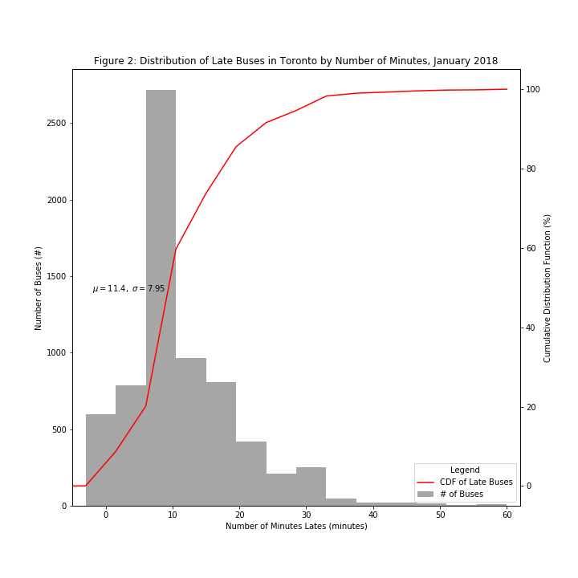

## cb4102 plot

Unless if it's explained, I do not understand why is the cumulative distribution dunction should be interesting to me. Other than that, I believe adding more lines to pinpoint the Distribution and histograms better. There is also alot of white space, and I think it might be better to increase the font size to take it up. Also, the distribution line is very much bumpy. Unless there isn't enough data to smooth it out, I don't see the reason why it's this bumpy. 

Other than that, the colors are coherent, probably put the mean and standard deviation statements to the right instead of the left, just so it doesn't blend in with the grey, and that's it. 

