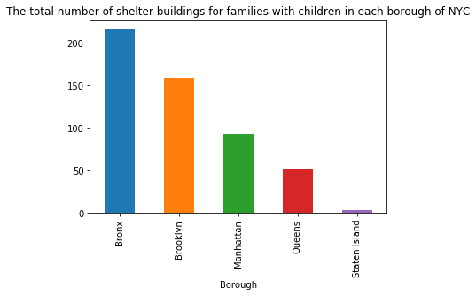

### Assignment 1: Plot Review

#### Rendered Plot:

### Review:

#### The title does not really describe what is in the graph. What is a "shelter building"? Since it is not identified in the description, I don't know what it is. Crucially, the y-axis is not labeled and the units are not identified which further obscures what the reader is looking at. I do not know what point in time

#### Plot type and style: I think it's good the bars are ordered from largest to smallest, however perhaps considering using one standard color and a second color to highlight the bar you want the reader to look at. Consider rotating the names of the Borough's to make it easier to read

#### Data: I would also consider reporting these values as a % of the population in each borough (or % of the population that are families). The percentages would tell a better story and would be more representative of the data. Further, shelter beds, not buildings, is probably a more representative unit of measurement, rather than buildings. Hypothetically, one shelter building in Manhattan could have 1000 beds and it counts for the same as a shelter building in Queens with 10 beds, or visa versa.
